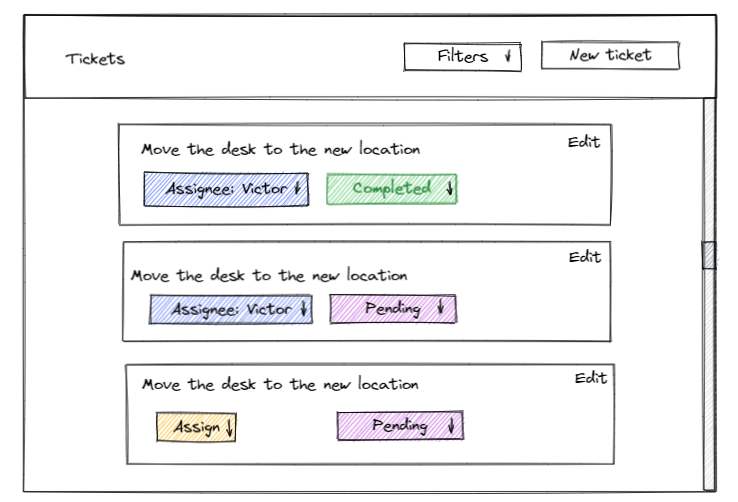
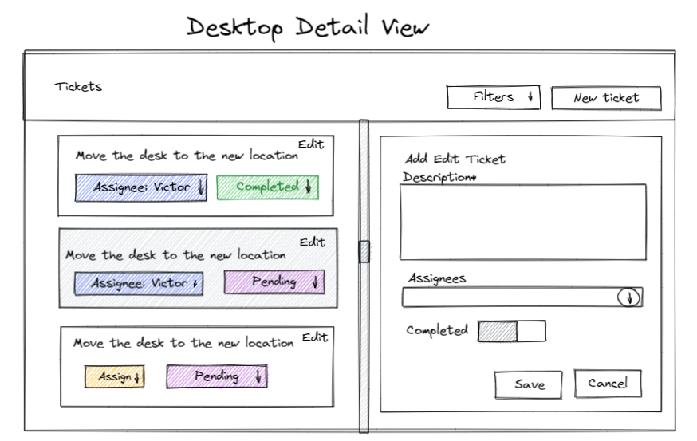
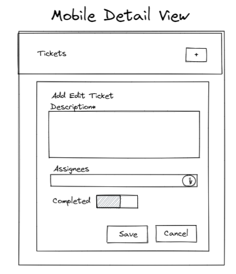

# Ticket managing app

Due to time constraints, I did some planning before working on the project. I also used  
the master-detail designs and some components from my existing project EpicERP.

## Priority and What is realistic in two hours

1. complete master detail functions
2. bare bone styles and designs

Please note, I spend more than 2 hours. Mostly trying to fix styles(it can be time-consuming and frustrating at times),
just to make it more presentable.

## Planning(outside time constraints)

### Design sketches - Final design is different.

1. list view

2. master/detail view
    1. desktop view: list on the left, detail on the right

   

    2. mobile view: not implemented due to time constraints

   

### Main Components:

1. `TicketMasterDetail`:root component hosting list and detail view
    1. left side: `TicketList`
    2. right side: `TicketDetail`
5. `TicketList`:
    1. get filtered tickets
    2. show tickets by rendering `TicketListView` which in turn rendering `TicketCard`.
2. `TicketCard`: display ticket information
    3. click to open ticket detail screen
    4. if selected, background color changes
3. `TicketDetail`: Load ticket and display `TicketForm`
4. `TicketForm`: Add Edit Ticket

### Backend Adapters

`useClient` is an adaptor to the mock backend so that it can be replaced by the real backend.

### Code copied from my existing project EpicERP

1. Input components like text field, autocomplete and switch. These components are integrated with react-hook-form,
   which also serve as adaptors for relevant material ui components.
3. `MessageContext` and `MessageSnackBar`, although I have got no time to use it, it would be nice to show users  
   success and error messages
3. `FullPageSpinner`

## Testing

1. tests for `Autocomplete` and `Textfield` are mostly from 'EpicERP'.
2. two new tests in `App.test.tsx`:
    1. test create a new ticket
    2. test edit ticket
3. not enough time to write more tests.

## next steps

1. more tests with jest and cypress
2. mobile view: hide list view, only show the detail view
3. `AssigneeButton`: dropdown list of users and assign user without using detail screen, to use `assign` API
4. `StatusButton`: click to toggle the status between 'completed' and 'pending' without using the detail screen, to  
   use `toggleStatus` API
5. Form: 
   1. route guard to prevent routing away while ticket form is dirty or saving is in progress
   2. message snackbar to show success and error message
6. Global error boundary
7. not found route page
8. polish styles
9. better filter
10. pagination
11. test Suspense fallback
12. better error handling
13. refactoring and clean up